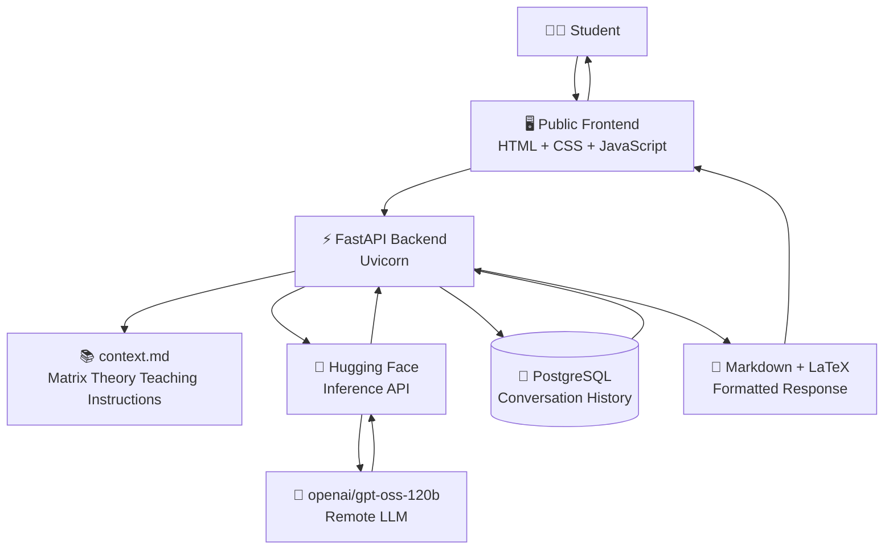

# 🧮 Matrix Mentor
### AI-Powered Matrix Theory Teaching Agent

<p align="center">
  <b>Learn • Ask • Understand • Practice</b><br>
  An interactive AI teaching assistant for Matrix Theory
</p>

<p align="center">


</p>

---

## 🎯 What is Matrix Mentor?

**Matrix Mentor** is an AI-powered teaching agent designed specifically for learning **Matrix Theory** through an interactive web interface.

Instead of behaving like a generic chatbot, the application uses a dedicated `context.md` file to define the subject scope, teaching philosophy, mathematical rigor, explanation style, formatting rules, and academic-integrity guidance.

A student's question travels through the web application, reaches the FastAPI backend, is combined with the Matrix Theory teaching context, and is sent to the remotely hosted `openai/gpt-oss-120b` model through the Hugging Face Inference API.

### 💡 The idea

```text
              STUDENT
                 │
                 ▼
        ┌─────────────────┐
        │  Matrix Mentor  │
        │   Web Interface │
        └────────┬────────┘
                 │
                 ▼
        ┌─────────────────┐
        │ FastAPI Backend  │
        └───────┬─────────┘
                │
        ┌───────┼───────────────┐
        ▼       ▼               ▼
   context.md  LLM          PostgreSQL
   Teaching   Hugging         Chat
 Instructions   Face         History
        │       │               │
        └───────┼───────────────┘
                ▼
        ┌─────────────────┐
        │ Teaching Answer │
        │ Markdown + LaTeX│
        └────────┬────────┘
                 │
                 ▼
              STUDENT
```

---

## ✨ Highlights

| 🧠 Teaching | ⚙️ Engineering | ☁️ Deployment |
|---|---|---|
| Intuitive explanations | FastAPI REST API | Render |
| Step-by-step reasoning | PostgreSQL history | Docker |
| Formal definitions | Modular frontend/backend | Hugging Face |
| Mathematical examples | Environment-based secrets | Public web access |
| Markdown + LaTeX | Context-driven prompting | Remote LLM inference |

---

## 🧑‍🏫 Teaching Capabilities

Matrix Mentor is designed to support:

- 📖 **Concept explanations**
- 🧩 **Step-by-step mathematical reasoning**
- 📐 **Formal definitions**
- 📝 **Worked examples**
- 🔢 **Problem-solving guidance**
- 💭 **Intuitive explanations**
- 🧮 **Mathematical notation using LaTeX**
- 📚 **Subject-specific teaching behavior**

### Example question

> **"Explain the Rank-Nullity Theorem with a simple example."**

The agent can structure the response around the theorem, explain rank and nullity, work through a matrix example, show calculations, and present the mathematical expressions using LaTeX.

---

## 🖥️ Application

The frontend provides an interactive chat interface where students can ask Matrix Theory questions and receive formatted mathematical explanations.

> 📸 **Add your Matrix Mentor UI screenshot here**  
> Recommended location: `docs/screenshots/matrix-mentor.png`

```html
<!-- After uploading the screenshot, you can enable this: -->

<p align="center">
  
</p>
```

---

## 🏗️ System Architecture



### 🔄 Request Flow

```text
Student Question
      │
      ▼
Web Frontend
      │
      ▼
FastAPI /ask
      │
      ├──────────────► context.md
      │
      ├──────────────► Hugging Face Inference API
      │                       │
      │                       ▼
      │                 gpt-oss-120b
      │
      └──────────────► PostgreSQL
                              │
                              ▼
                       Chat History
      │
      ▼
Markdown + LaTeX Response
      │
      ▼
Student
```

---

## 🧩 Core Components

### 1. 🎨 Frontend

Built using:

- HTML
- CSS
- JavaScript
- Marked.js
- MathJax

The frontend provides the interactive Matrix Theory chat experience and renders Markdown and mathematical expressions.

### 2. ⚡ FastAPI Backend

The backend provides the REST API and coordinates:

```text
Request
  ↓
Teaching Context
  ↓
LLM Inference
  ↓
Database
  ↓
Response
```

### 3. 📚 Context-Based Teaching

`context.md` acts as the subject-specific teaching layer.

It defines:

- Matrix Theory scope
- Teaching philosophy
- Mathematical rigor
- Problem-solving guidance
- Explanation style
- Formatting rules
- Academic-integrity guidance

This allows the same underlying LLM to behave as a **Matrix Theory teaching agent** rather than simply providing generic responses.

### 4. 🧠 Remote LLM

The application uses:

```text
openai/gpt-oss-120b
```

through the **Hugging Face Inference API**.

The model is remotely hosted; it is not executed locally by the application.

### 5. 🐘 PostgreSQL

Conversation history is stored using PostgreSQL.

This supports retrieval of recent conversations and individual chat histories.

---

## 🛠️ Technology Stack

| Layer | Technology |
|---|---|
| 🎨 Frontend | HTML, CSS, JavaScript |
| ⚡ Backend | FastAPI + Uvicorn |
| 🧠 LLM | `openai/gpt-oss-120b` |
| 🤗 LLM Platform | Hugging Face Inference API |
| 🔌 LLM Client | `huggingface_hub` |
| 🐘 Database | PostgreSQL |
| 🔐 Configuration | `python-dotenv` |
| 📐 Math Rendering | MathJax |
| 📝 Markdown | Marked.js |
| 🐳 Containerization | Docker |
| ☁️ Deployment | Render |
| 🐍 Language | Python |

---

## 📁 Project Structure

```text
MatrixthheoryAGent/
│
├── .env.example
├── .gitignore
├── .dockerignore
├── Dockerfile
├── README.md
├── requirements.txt
├── context.md
├── app.py
├── projectplan.md
│
├── backend/
│   ├── main.py
│   ├── crud.py
│   ├── database.py
│   └── models.py
│
├── frontend/
│   ├── index.html
│   ├── script.js
│   └── style.css
│
└── docs/
    └── screenshots/
        └── matrix-mentor.png
```

> 🔐 `.env` contains secrets and should **never be committed** to GitHub.

---

## 🚀 Getting Started

### Prerequisites

Make sure you have:

- Python 3.x
- pip
- Git
- PostgreSQL (for local database use)
- Docker (optional)

---

### 1️⃣ Clone the repository

```bash
git clone https://github.com/YOUR_USERNAME/matrix-theory-teaching-agent.git
cd matrix-theory-teaching-agent
```

---

### 2️⃣ Install dependencies

```bash
pip install -r requirements.txt
```

---

### 3️⃣ Configure the environment

Create a `.env` file in the project root:

```env
HF_TOKEN=your_huggingface_token
```

If database configuration is required by the current backend, add the corresponding PostgreSQL environment variables used by the application.

### 🔐 Security rule

**Never commit `.env` or a real API token to GitHub.**

Use:

```text
.env.example
```

to document the required variables without exposing secrets.

---

## ⚡ Run the Backend Locally

```bash
cd backend
python3 -m uvicorn main:app --reload
```

Backend:

```text
http://127.0.0.1:8000
```

FastAPI Swagger documentation:

```text
http://127.0.0.1:8000/docs
```

---

## 🖥️ Run the Frontend Locally

In another terminal:

```bash
cd frontend
python3 -m http.server 5500
```

Then open:

```text
http://127.0.0.1:5500
```

---

## 🐳 Docker

Build the backend image:

```bash
docker build -t matrix-mentor-backend .
```

The Docker image contains the backend and `context.md`.

Secrets should be supplied at runtime rather than baked into the image.

---

## ☁️ Deployment Architecture

The deployed system separates the major services:

```text
                ☁️ CLOUD
                   │
       ┌───────────┼────────────┐
       │           │            │
       ▼           ▼            ▼
   Render       Render       Render
   Frontend     Backend     PostgreSQL
   Static Site  Web Service   Database
                   │
                   ▼
          Hugging Face API
                   │
                   ▼
          gpt-oss-120b
```

### Deployment Components

| Service | Role |
|---|---|
| Render Static Site | Public frontend |
| Render Web Service | FastAPI backend |
| Render PostgreSQL | Conversation history |
| Hugging Face | Remote LLM inference |

---

## 🌐 Public Backend

**Backend:**

https://matrix-mentor-backend.onrender.com

**API Documentation:**

https://matrix-mentor-backend.onrender.com/docs

> Add the final Render Static Site URL above once the public frontend URL is finalized.

---

## 🔌 API Endpoints

| Method | Endpoint | Purpose |
|---|---|---|
| `GET` | `/` | Backend health check |
| `POST` | `/ask` | Send a Matrix Theory question |
| `GET` | `/history` | Retrieve recent chat history |
| `GET` | `/history/{chat_id}` | Retrieve a specific conversation |

### Example API Flow

```text
POST /ask
    │
    ▼
Question + Context
    │
    ▼
Hugging Face Inference
    │
    ▼
Generated Teaching Response
    │
    ▼
Stored in PostgreSQL
    │
    ▼
Returned to Frontend
```

---

## 🔐 Security

The project follows environment-based credential handling:

- 🔑 API credentials are stored in environment variables.
- 🚫 Tokens are not hard-coded.
- 🛡️ Secret environment files are excluded using `.gitignore`.
- ☁️ The LLM is accessed remotely.
- 🐳 Docker secrets are supplied at runtime.

### Never commit

```text
.env
API keys
Hugging Face tokens
Database passwords
Private credentials
```

---

## 🧪 Testing

The deployed frontend was tested by submitting Matrix Theory questions and receiving generated responses.

The backend was also verified through **FastAPI Swagger documentation**.

Example test:

```text
Question:
"Explain the Rank-Nullity Theorem with a simple example."

        ↓

FastAPI

        ↓

Matrix Theory Context + LLM

        ↓

Generated Explanation

        ↓

Markdown + LaTeX Rendering
```

---

## 📈 Future Scope

| Feature | Purpose |
|---|---|
| 📚 Topic-wise modules | Structured Matrix Theory learning |
| 🧠 Quiz generation | Active learning and self-testing |
| 📊 Progress tracking | Monitor student learning |
| 🔎 Lecture-note retrieval | Ground answers in course material |
| 🎙️ Voice interaction | Spoken questions and responses |
| ✅ Solution evaluation | Automated checking of student solutions |
| 📐 Mathematical visualizations | Visual understanding of matrix concepts |

---

## 🎓 Learning Outcomes

This project demonstrates practical experience with:

- AI/LLM application development
- Prompt/context engineering
- REST API development
- FastAPI
- Frontend-backend integration
- Database-backed applications
- PostgreSQL
- Docker
- Cloud deployment
- Environment-based secret management
- Mathematical Markdown and LaTeX rendering

---

## ⭐ Why Matrix Mentor?

```text
Generic Chatbot
      │
      ▼
     ❌
Generic responses

Matrix Mentor
      │
      ├── Matrix Theory context
      ├── Teaching instructions
      ├── Mathematical formatting
      ├── Step-by-step explanations
      ├── Conversation history
      └── Dedicated web interface
      │
      ▼
     🧮
Domain-focused AI learning experience
```

---

## 👨‍💻 Author

**AmarDeep Dwivedi**

M.Tech — Communication, Signal Processing and Machine Learning (CSPML)  
IIT Dharwad

---

## 📜 License

This project is intended for educational and research purposes.

---

<p align="center">
  <b>🧮 Learn Matrix Theory. Ask Better Questions. Understand the Mathematics.</b>
</p>
